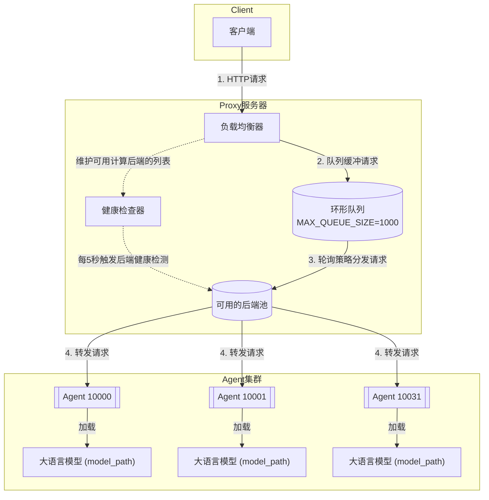

# Easy Model Service介绍

Easy Model Service (EMS) 是一个轻量级的模型服务器，支持部署异构后端的大模型推理服务，在工作中可以帮助大规模的刷库任务。EMS 基于fastapi，包含了一个Proxy和多个Agent，如下框图所示。对比简单采用`mpirun`进行大规模刷库，主要功能点有：

1. 计算后端的健康检查：每5秒钟触发健康检查，检测当前后端列表中是否有节点不可用，从而将不可用的后端剔除，并且当后端节点自愈后能够自动加入可用后端池子参与计算。
2. 支持异构计算资源的后端：对于生产环境，可能具有不同类型的计算后端，包括GPU（还包括不同厂商）/CPU/NPU等等，计算和流量承接解耦的方式有利于异构资源的统一调度，隐藏具体计算后端的差异。
3. 调试灵活性：基于请求的方式触发计算，比起`mpirun`具有更高的调试灵活性。




# 如何启动

启动前确保已经安装好了基本依赖，可以新建个虚拟环境避免污染。

```shell
python -m venv .venv
source .venv/bin/activate  # for Linux/Mac
pip install -r requirement.txt
```


启动

```shell
# 1. 拉取仓库
git clone https://github.com/FesianXu/Easy-Model-Service.git EMS
cd EMS

# 2. 启动agent，如果有多个节点，可以采用mpirun启动。
source ./utils.sh
mpirun_start_agents

# 3. 启动proxy
sh ./start_proxy.sh

# 4. 用户端发起异步的请求
python my_request.py
```


